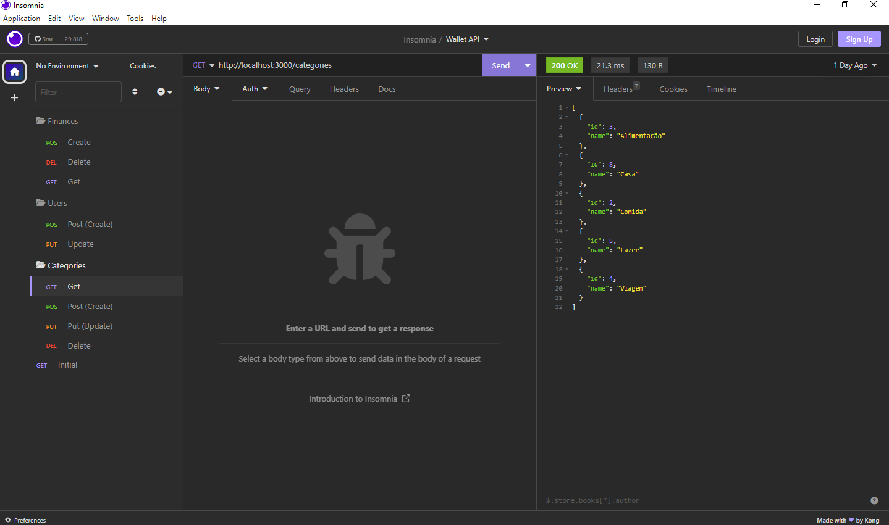

# Wallet App API (Back-end)

## Intro

This is an API created using Node.js,Express and PostGresSQL.
The main goal is create an application that controls user finances.

# Documentation:

Use insomina to import the file bellow:

```
https://github.com/Cunh4Bri/wallet-app-api/blob/main/Insomnia.json
```

## Requirements

-Node.js
-Docker

## Steps to run the project

1.Clone the project

```
git clone https://github.com/Cunh4Bri/wallet-app-api.git
```

2. Navigate to project folder and Install Dependencies

```
cd wallet-app-api
npm install
```

3. Create an PostGres instance no docker

```
Example:
docker run --name postgres-finances -e POSTGRES_PASSWORD=docker -e POSTGRES_USER=docker -p 5432:5432 -d -t postgres
```

4. Create a .env file following the example:

```
DB_USER=docker
DB_PASSWORD=docker
DB_NAME=finances
DB_HOST=localhost
DB_PORT=5432
```

5. Run config script to create database and tables:

```
First create a database before using the command below:
npm run config:init
Observation: if don't stop press CTRL + C
```

6. Run the project in dev version:

```
npm run start:dev
```

7. Run the project in final version:

```
npm run start
```

## Exemple image Isomnia:


